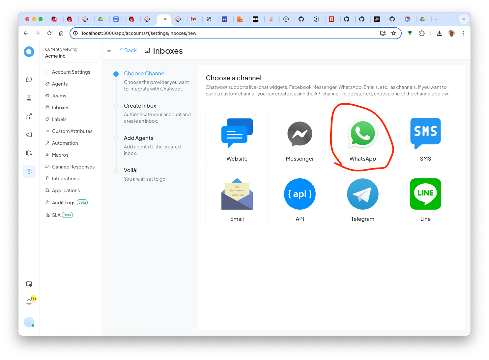
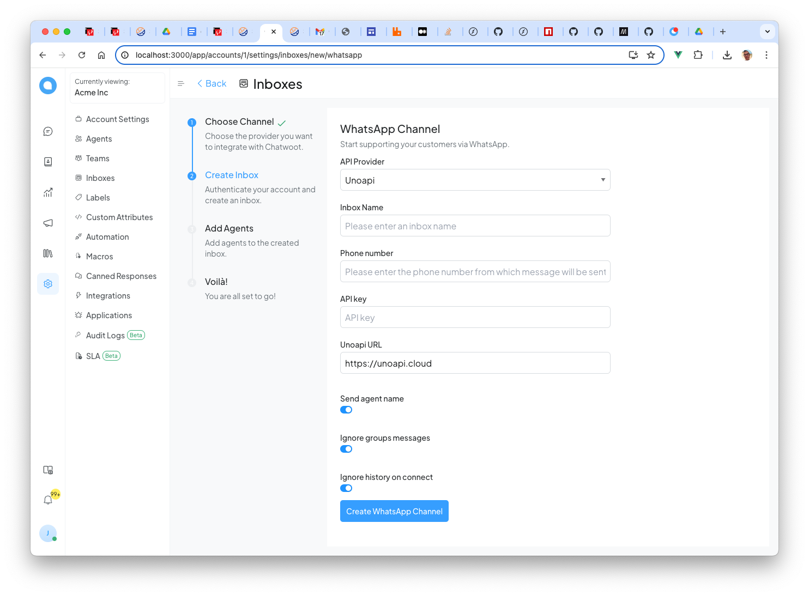
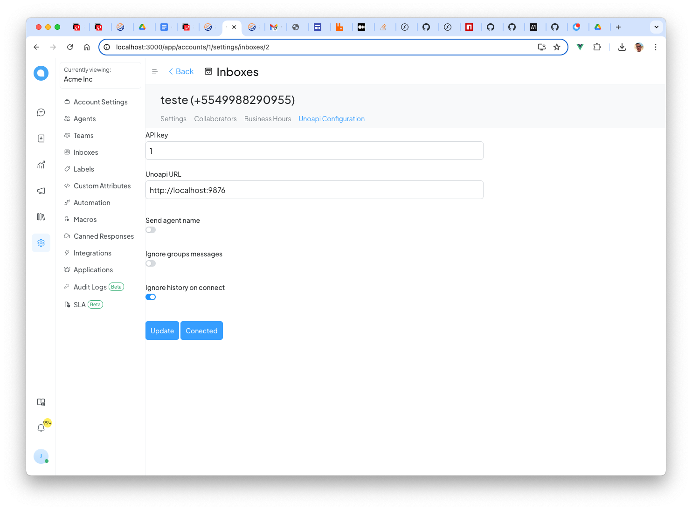
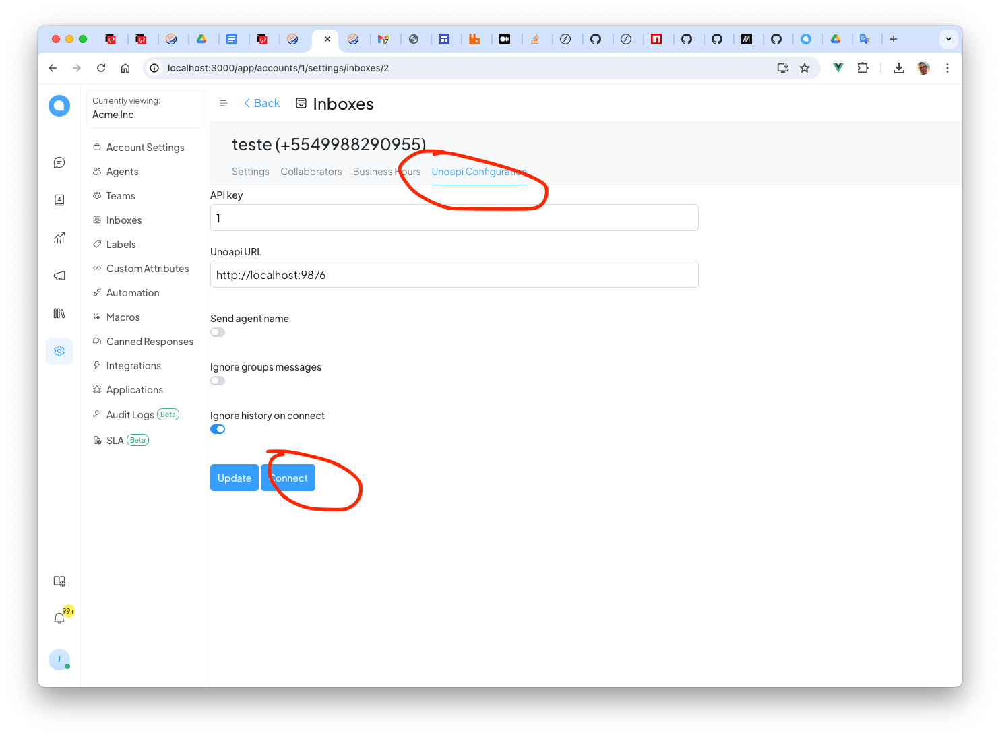
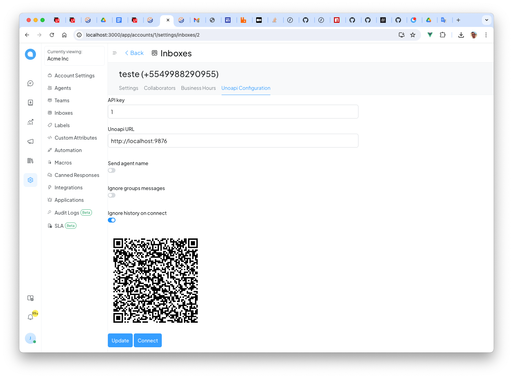

# Chatwoot with Unoapi inbox

Up the unoapi service with `https://github.com/clairton/unoapi-cloud/tree/main?tab=readme-ov-file#start-options` or `https://github.com/clairton/unoapi-cloud/#install-as-systemctl`, use version >= 1.17.0

Get the chatwoot in `https://github.com/clairton/chatwoot` ou docker tag `clairton/chatwoot:v3.10.6-uno` change the env `UNOAPI_AUTH_TOKEN` with the same value of unoapi

Got to inboxes and choose whatsapp

Create with provider unoapi

After save, edit the channel and in tab configuration

Click em connect

Read de qrcode

