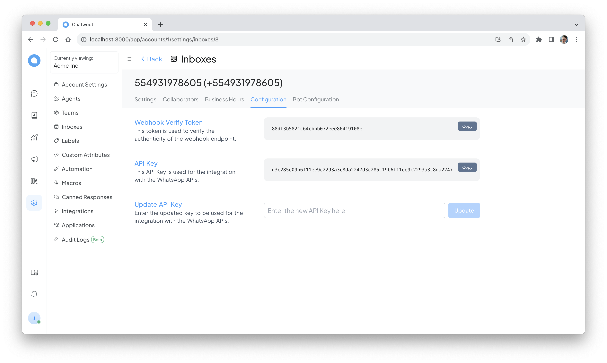

# Unoapi Cloud with Chatwoot

Get the chatwoot source or image and change the env `WHATSAPP_CLOUD_BASE_URL=http://localhost:9876` and up, or use a custom version with some features to integrate with in `https://github.com/clairton/chatwoot`:
- put the agent name in message
- use official whatsapp cloud api and unoapi in the same chatwoot instance
- send read events to unoapi
- work with groups
- show message sent by another whatsapp connection
- disable 24 window
- sicronize user and group profile image

Copy the token 

Up the unoapi service with `https://github.com/clairton/unoapi-cloud/tree/main?tab=readme-ov-file#start-options` or `https://github.com/clairton/unoapi-cloud/#install-as-systemctl`

Put in .env 

```env
WEBHOOK_URL=http://localhost:3000/webhooks/whatsapp
WEBHOOK_TOKEN=the_chatwoot_token 
WEBHOOK_HEADER=api_access_token
````

Change the_chatwoot_token for your token.

Create a inbox in Chatwoot with Whatsapp Cloud API type, in "Phone number ID" and "Business Account ID" put the number without "+". In API Key put the same content of env UNOAPI_AUTH_TOKEN


Create a contact with de same number, and send a message.


In a contact with the same number read the qrcode.


If you up unoapi with redis, on create instance show message with new token



Put the new auth token in chatwoot inbox config


