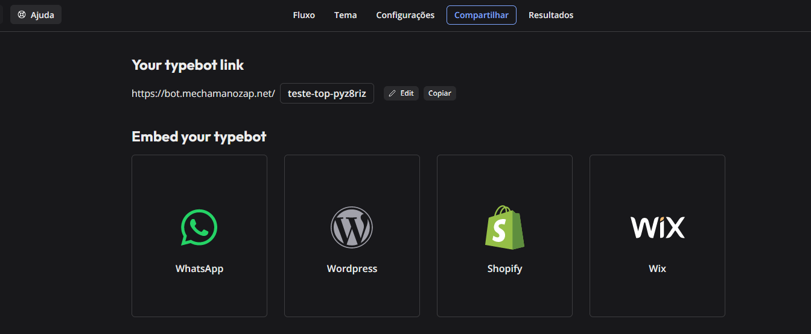
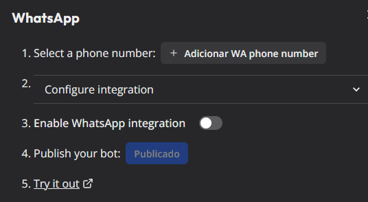
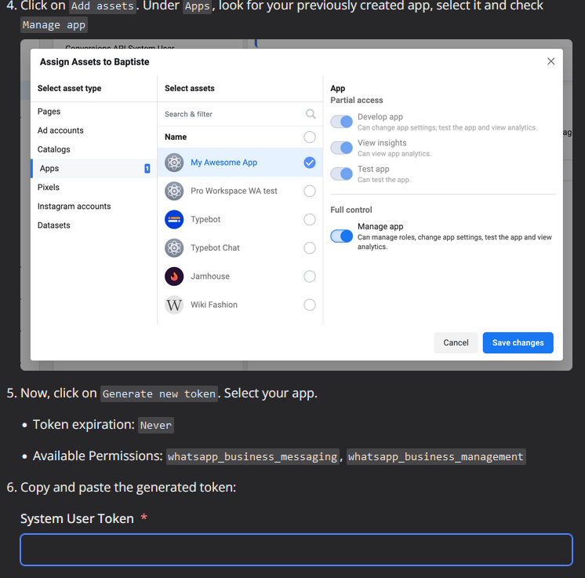
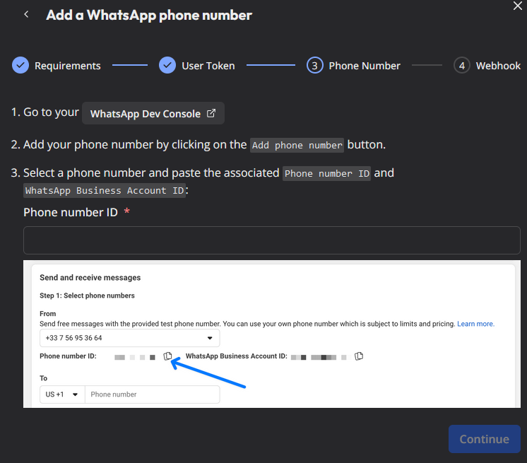
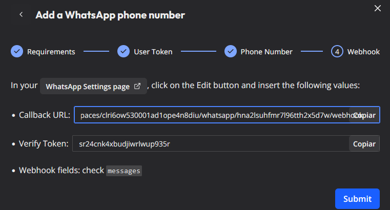
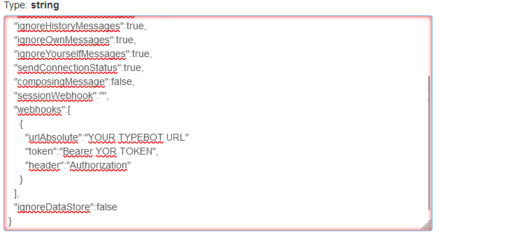
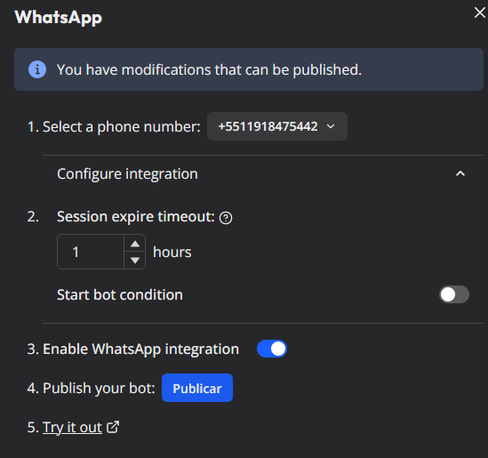
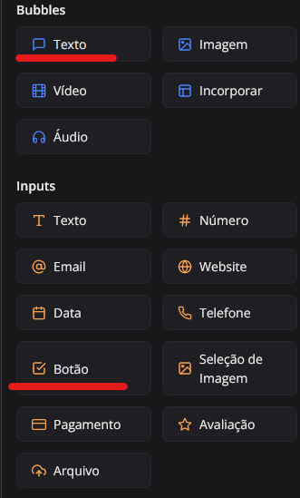
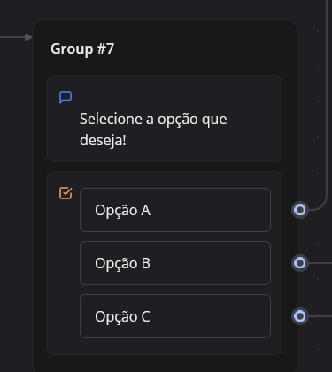

# Unoapi Cloud with Typebot

Get the typebot source or image and change the env `WHATSAPP_CLOUD_API_URL` to you Unoapi url (ex: `http://localhost:9876` 

In your typebot flow go to Share > Whatsapp  

Click on Add WA Phone Number 

Click in continue

In the System User Token, put the token from the Unoapi env (authToken  ) 

In the Phone number ID, put the phone number without the + sign, ex 55999999999  ) 

Put the callback url and token in the unoapi redis or .env config, exemple below.





```env
  "webhooks":[
    {
      "urlAbsolute":"YOUR TYPEBOT URL"
      "token":"Bearer YOR TOKEN",
      "header":"Authorization"
    }
  ],
````

And click in submit on typebot 

After, enable the integration on typebot and click in Publish. 

# Lists with typebot

### Some observations before using list on Typebot, by default Typebot is not ready to work with lists, so has some limitations. 

* Use max of 3 itens in the list, if you use more will be send another list

## How to use

To use lists, you need to use the text bubble followed by button input. 



## Config unoapi to not send message to type for some numbers
To work with this, set a unique id field in webhook json in redis or if use envs config, the id of webhook is a string `default`

For exemplo, if your session number is Y and you want do webhook with id W to never send more message to number X

ttl param is in seconds

To remove a phone number your black, send ttl with 0, with ttl -1, never expire

```sh
curl -i -X POST \
'http://localhost:9876/Y/blacklist/W' \
-H 'Content-Type: application/json' \
-H 'Authorization: 1' \
-d '{ 
  "ttl": -1, 
  "to": "X"
}'
```

Or in url format
```sh
curl -i -X POST 'http://localhost:9876/5549988290955/blacklist/type?to=5549999621461&ttl=-1&access_token=1'
```

## Config unoapi to send message after a time without reply
For exemplo, if your session number is Y and you want to send a message ? after 36000 milliseconds without reply to number X

```sh
curl -i -X POST \
'http://localhost:9876/timer/Y/X' \
-H 'Content-Type: application/json' \
-H 'Authorization: 1' \
-d '{ 
  "timeout": 36000,
  "message": "?"
}'
```

Or in url format
```sh
curl -i -X POST 'http://localhost:9876/timer/Y/X?timetout=360&message=hummm&access_token=1'
```

Where has a response, dont forgot remove the timer sending with

```sh
curl -i -X DELETE \
'http://localhost:9876/timer/Y/X' \
-H 'Content-Type: application/json' \
-H 'Authorization: 1'
```


curl -i -X POST \
'http://localhost:9876/timer/554931978550/5549988290955' \
-H 'Content-Type: application/json' \
-H 'Authorization: 1' \
-d '{ 
  "timeout": 1,
  "message": "Oi, ainda está ai? =)"
}'