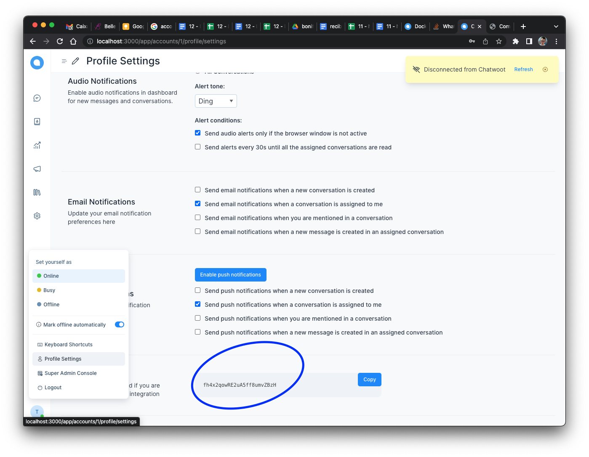
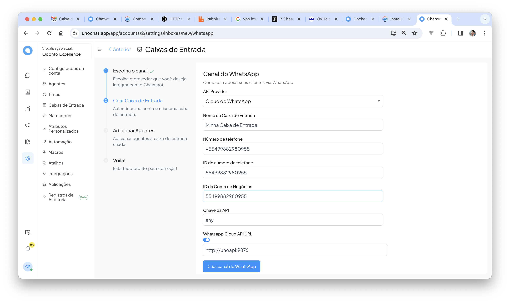
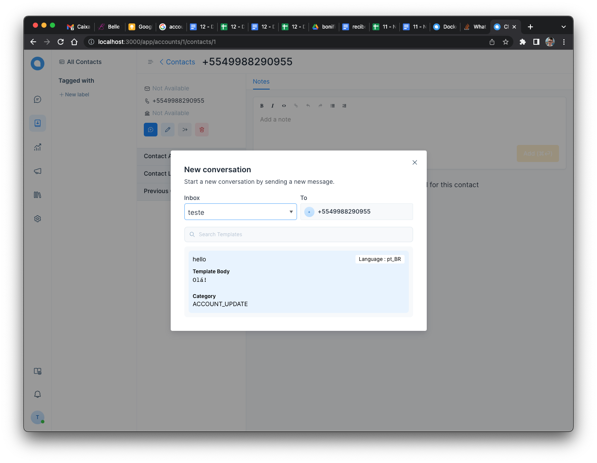
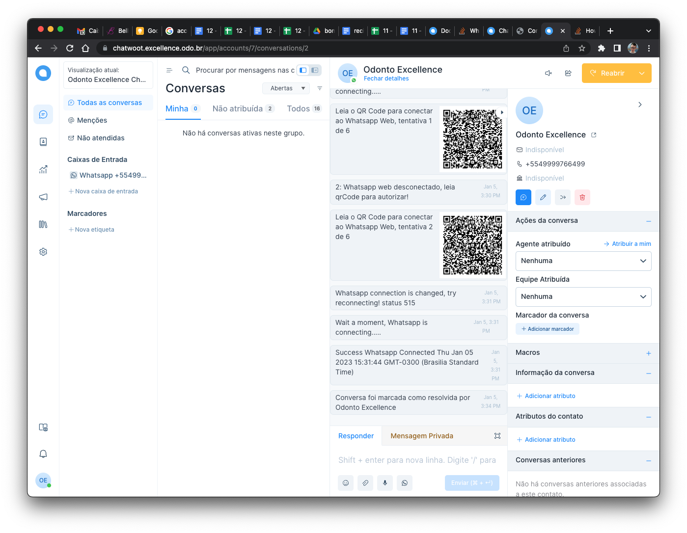
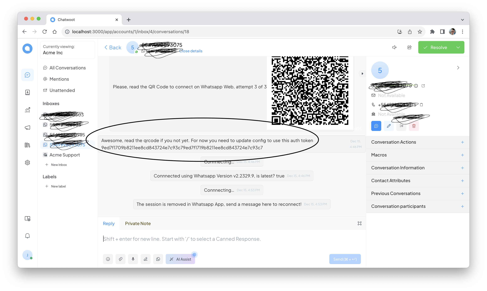
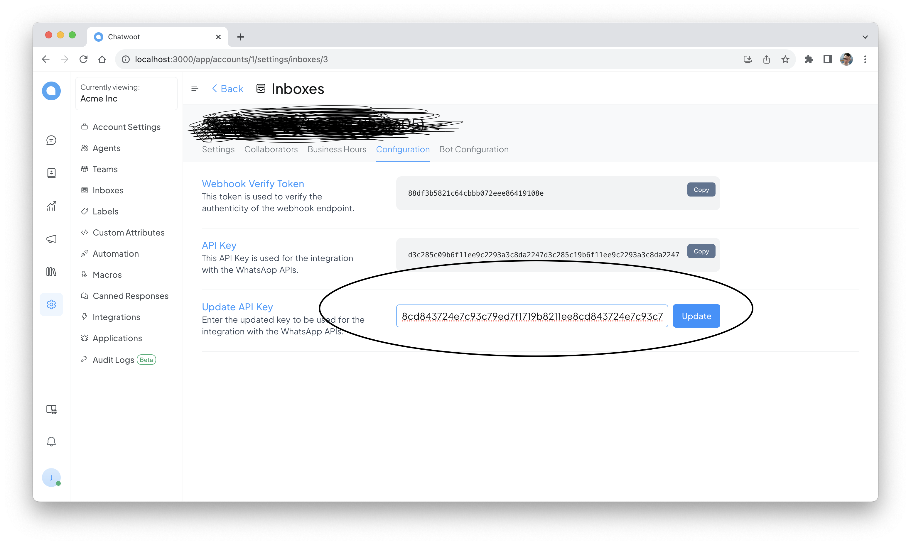

# Unoapi e Chatwoot em poucos comandos

OBS: 
  - vou utilizar meu dominio lvh.me e você deve trocar pelo seu.
  - essa versão do chatwoot que esta sendo usada aqui tem algumas customizações que ainda não foram aceitas pelo time do chatwoot:
    - coloca o nome do agente na mensagem
    -⁠ pode editar o endereço da caixa de entrada do whatsapp, assim pode usar a oficial e a unoapi na mesma instalação
    - marca as mensagem no whatsapp como lido quando o agente visualiza a conversa
    - funciona as conversas em grupo
    -⁠ trata a mensagem enviads por outras conexões, inclusive o aplicativo
    -⁠ desabilita a janela de 24 horas do whatsapp cloud oficial
    - sincroniza as imagens de perfil dos grupos e usuarios

1 - Para iniciar você precisa apontar os DNS para o ip da sua VPS, isso deve ser feito no registro.br, cloudflare, ou no lugar onde você tem configurado o seu dominio:
  - chatwoot.lvh.me
  - minio.lvh.me

2 - A sua VPS precisa ter o docker e o docker compose instalados, pode mais mais detalhes aqui `https://docs.docker.com/engine/install/`

3 - Logue em sua vps e faça download do docker-compose.yml e .env em uma pasta unochat:
  - `mkdir unochat`
  - `cd unochat`
  - `wget -O .env https://raw.githubusercontent.com/clairton/unoapi-cloud/main/examples/unochat/.env`
  - `wget -O docker-compose.yml https://raw.githubusercontent.com/clairton/unoapi-cloud/main/examples/unochat/docker-compose.yml`

4 - Altere os dados, nesse caso senhas e dominios no .env conforme os seus dados, são essas variaveis que necessitam ser editadas:
  - CHATWOOT_DOMAIN
  - MINIO_DOMAIN
  - LETSECRYPT_EMAIL
  - STORAGE_SECRET_ACCESS_KEY
  OBS: para editar esses dados pode usar o editor de texto como o nano, vi ou vim ou até mesmo por FTP

5 - Agora vamos subir os serviços:
  - `docker compose up -d`

6 - Crie a conta no chatwoot e copie o token de autenticação que vamos atualizar para o uso na unoapi:

7 - Novamente edite o arquivo .env e cole esse valor na env WEBHOOK_TOKEN, vai ficar mais ou menos assim:
  - `WEBHOOK_TOKEN=conteudo_do_token_copiado_do_chatwoot`

8 - Após isso precisa reiniciar o serviço do unoapi para ele ler esse valor:
  - `docker compose restart unoapi`

9 - Novamente no chatwoot, crie um caixa de entrada, com o tipo Whatsapp, em "ID do número de telefone" e "ID da Conta de Negócios" use o mesmo numero de telefone sem o "+", outra questão importante para o Brasil, use o numero se for celular, com 9 digito. Em "Whatsapp Cloud API URL" habilite a edição e deixe com o conteudo "http://unoapi:9876"

10 - Agora crie um contato com o mesmo número do inbox.

11 - Envia qualquer mensagem, o unoapi vai perceber que o numero ainda não está conectado e vai enviar o qrcode para você ler.

12 - O unoapi vai desolver um novo token de autenticação especifico para esse numero/sessão para você

13 - Cole esse token na caixa de entrada, para garantir que haja a comunicação entre o chatwoot e unoapi

14 - Honre a Deus, seja Feliz, beba água, contribua com melhorias para o opensource, não faça spam e se quiser mandar uma doação, os dados estão no readme principal.